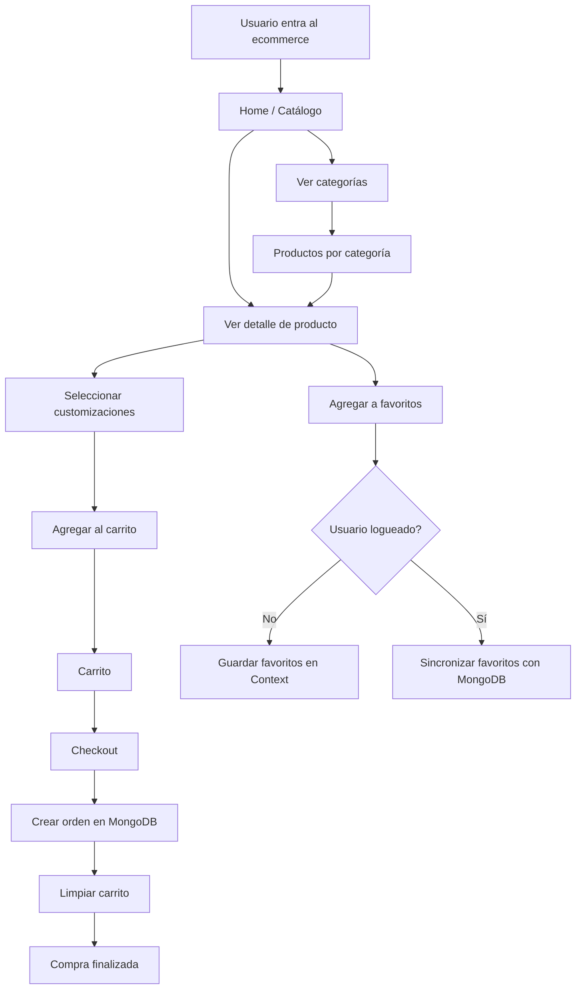
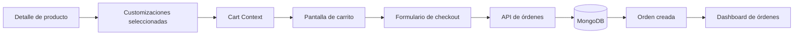
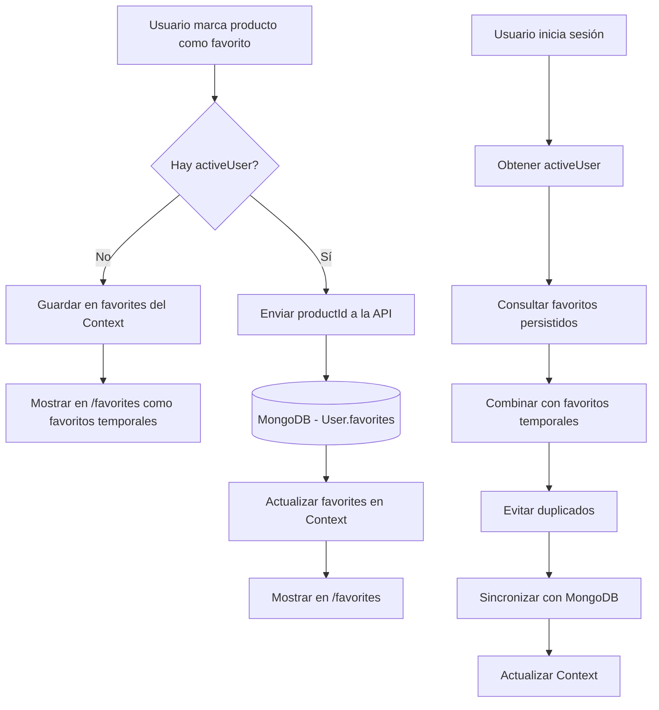
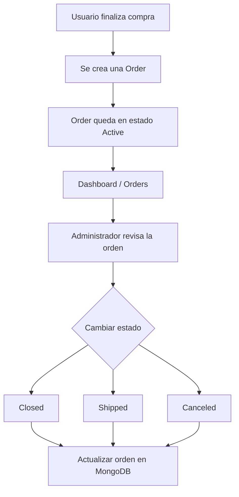

# TP 4: Desarrollo de un Ecommerce con Productos Customizables

## 1. Presentacion

El presente trabajo practico tiene como objetivo desarrollar una aplicacion web de ecommerce utilizando Next.js, MongoDB, Mongoose y TailwindCSS.

La aplicacion debera permitir la publicacion, visualizacion y compra de productos que posean opciones de customizacion. El usuario final podra seleccionar dichas opciones, agregar productos personalizados al carrito, marcar productos como favoritos y finalizar una compra generando una orden en la base de datos.

El proyecto parte de una base inicial con CRUD de productos y categorias. A partir de esta base, cada estudiante debera extender el sistema hasta convertirlo en una aplicacion funcional de ecommerce.

## 2. Objetivo General

Construir un sitio de ecommerce completo que permita administrar productos y categorias, visualizar productos en una tienda publica, customizar productos antes de agregarlos al carrito, registrar usuarios, gestionar favoritos y generar ordenes de compra persistidas en MongoDB.

## 3. Objetivos Especificos

El estudiante debera:

- Implementar productos con opciones de customizacion.
- Crear pantallas publicas de catalogo, categorias y detalle de producto.
- Implementar un carrito de compras usando Context API.
- Gestionar productos favoritos del usuario.
- Crear la entidad usuario y permitir registro/login.
- Mantener un usuario activo en el estado global de la aplicacion.
- Crear la entidad order y persistir compras en la base de datos.
- Generar numeros secuenciales para las ordenes.
- Implementar una pantalla de checkout.
- Aplicar un diseño moderno y responsive con TailwindCSS.
- Organizar correctamente rutas, modelos, componentes, librerias y acciones del proyecto.

## 4. Descripcion Funcional

El ecommerce debe permitir que un usuario navegue productos, vea el detalle de cada uno y seleccione distintas opciones de customizacion antes de comprar.

Por ejemplo, si la tienda vende cookies, un producto podria tener las siguientes opciones:

- Tipo de masa: vainilla, chocolate, red velvet.
- Topping: glasé, dulce de leche, crema.
- Chips: chocolate blanco, chocolate negro, frutos secos.

El usuario debera poder elegir una combinacion de opciones y agregar al carrito la cantidad de unidades que desee. Si agrega el mismo producto con otra combinacion de opciones, debera registrarse como un item distinto dentro del carrito.

## 5. Requerimientos Obligatorios

### 5.1 Productos

Cada producto debe incluir, como minimo:

- Nombre.
- Descripcion.
- Precio.
- Stock.
- Imagen.
- Categorias.
- Opciones o atributos de customizacion.

Los productos deben poder pertenecer a muchas categorias. No se contemplan subcategorias.

Se debe implementar la funcion:

```js
getProduct(id)
```

Esta funcion debera obtener un producto por su ID y ser utilizada en la pantalla de detalle del producto.

### 5.2 Categorias (Resuelto a modo de ejemplo)

La aplicacion debe permitir:

- Crear categorias.
- Listar categorias.
- Editar categorias.
- Eliminar categorias.
- Asociar productos a una o varias categorias.
- Ver productos pertenecientes a una categoria.

La ruta publica de categorias debe incluir:

```bash
/categories
/category/[id]
```

### 5.3 Pantalla de Producto

Se debe crear la ruta:

```bash
/product/[id]
```

La pantalla de producto debe mostrar:

- Foto del producto.
- Titulo.
- Descripcion.
- Precio.
- Stock disponible.
- Categorias asociadas.
- Atributos u opciones de customizacion.
- Selector de cantidad.
- Boton para agregar al carrito.
- Boton para agregar o quitar de favoritos.
- Productos relacionados por categoria.

Los productos relacionados deben obtenerse a partir de alguna categoria compartida con el producto actual.

### 5.4 Imagenes de Productos

Las imagenes de productos deben almacenarse dentro de la carpeta:

```bash
public/images/products/
```

En la base de datos se debe guardar solamente el nombre del archivo.

Ejemplo:

```json
{
  "image": "imagen01.jpg"
}
```

Luego, en la aplicacion, la imagen debe referenciarse como:

```bash
/images/products/imagen01.jpg
```

No se deben guardar URLs externas como requisito principal del trabajo.

### 5.5 Context Global de la Aplicacion

Se debe crear un context global para administrar el estado principal de la aplicacion.

El context debe incluir, como minimo, tres estados:

- `cart`: listado de productos agregados al carrito.
- `favorites`: listado de productos favoritos. Si el usuario no inicio sesion, se mantienen temporalmente en el context. Si el usuario esta logueado, deben sincronizarse con la base de datos.
- `activeUser`: datos del usuario activo luego del login.

El context debe proveer funciones para:

- Agregar productos al carrito.
- Quitar productos del carrito.
- Cambiar cantidades.
- Vaciar el carrito.
- Agregar productos a favoritos.
- Quitar productos de favoritos.
- Guardar el usuario activo.
- Cerrar sesion o limpiar el usuario activo.

Como `activeUser` vive en el context de la aplicacion, las consultas que dependan del usuario activo deben realizarse desde el lado cliente. Por ejemplo, una vez que el usuario hizo login y `activeUser` tiene su ID, se debe hacer un `fetch` desde un componente cliente o desde una funcion del context para traer informacion asociada a ese usuario, como sus favoritos.

### 5.6 Carrito

Se debe crear la ruta:

```bash
/cart
```

La pantalla del carrito debe mostrar:

- Productos agregados.
- Imagen o referencia visual del producto.
- Nombre del producto.
- Customizaciones seleccionadas.
- Precio unitario.
- Cantidad.
- Subtotal por item.
- Total general.

Desde el carrito, el usuario debe poder:

- Incrementar o disminuir cantidades.
- Eliminar productos.
- Continuar al checkout.

El carrito debe contemplar productos customizados. Dos productos con el mismo ID pero con distintas opciones elegidas deben considerarse items distintos.

### 5.7 Favoritos

El usuario debe poder marcar productos como favoritos.

Se debe crear la ruta:

```bash
/favorites
```

Esta pantalla debe mostrar el listado de productos favoritos disponibles en el context. Si el usuario no inicio sesion, se mostraran los favoritos temporales. Si el usuario esta logueado, se mostraran los favoritos sincronizados con la base de datos.

La carga de favoritos persistidos debe realizarse desde el cliente, usando el ID disponible en `activeUser`.

Ejemplo de flujo esperado para un usuario logueado:

- El usuario inicia sesion.
- El usuario queda guardado en el context como `activeUser`.
- La aplicacion toma `activeUser._id`.
- Se realiza un `fetch` a una ruta de API para obtener los favoritos desde la base de datos.
- La respuesta se guarda en el estado `favorites` del context.

Un endpoint posible seria:

```bash
GET /api/users/[userId]/favorites
```

La base de datos debe guardar solamente los IDs de los productos favoritos, pero la API puede devolver los productos completos usando `populate` para facilitar el renderizado de la pantalla `/favorites`.

Ejemplo de campo en el modelo `User`:

```js
favorites: [
  {
    type: mongoose.Schema.Types.ObjectId,
    ref: "Product",
  },
]
```

Ejemplo de consulta en la API:

```js
const user = await User.findById(userId).populate("favorites");

return Response.json({
  favorites: user.favorites,
});
```

Si el usuario todavia no inicio sesion:

- Puede marcar productos como favoritos.
- Esos favoritos deben guardarse temporalmente en el estado `favorites` del context.
- No se guardan todavia en la base de datos porque no existe un usuario asociado.

Cuando el usuario inicia sesion:

- Se deben obtener los favoritos persistidos del usuario desde la base de datos.
- Se deben combinar con los favoritos temporales que estaban en el context.
- Se debe evitar duplicar productos.
- Se debe sincronizar el resultado final con la base de datos.
- Se debe actualizar el estado `favorites` del context con la lista final.

Endpoints sugeridos para favoritos:

```bash
GET /api/users/[userId]/favorites
POST /api/users/[userId]/favorites
DELETE /api/users/[userId]/favorites/[productId]
PUT /api/users/[userId]/favorites/sync
```

Uso esperado de cada endpoint:

- `GET /api/users/[userId]/favorites`: obtiene los favoritos del usuario desde la base de datos.
- `POST /api/users/[userId]/favorites`: agrega un producto a favoritos. El body puede incluir `{ "productId": "..." }`.
- `DELETE /api/users/[userId]/favorites/[productId]`: quita un producto de favoritos.
- `PUT /api/users/[userId]/favorites/sync`: recibe un array de IDs de productos favoritos y lo sincroniza con los favoritos existentes del usuario, evitando duplicados.

La pantalla de favoritos debe permitir:

- Visualizar los productos guardados como favoritos.
- Acceder al detalle de cada producto.
- Quitar productos de favoritos.
- Mostrar un mensaje claro si el usuario no tiene favoritos cargados.

Cuando un producto se agrega a favoritos:

- Debe actualizarse el estado `favorites` del context.
- Debe guardarse en la base de datos asociado al usuario.

Cuando un producto se quita de favoritos:

- Debe actualizarse el estado `favorites` del context.
- Debe quitarse de la base de datos.

En la base de datos se deben almacenar solamente los IDs de los productos favoritos.

### 5.8 Usuarios

Se debe crear la entidad `User`.

El usuario debe poder:

- Registrarse.
- Crear un registro en la base de datos.
- Iniciar sesion.
- Obtener sus datos desde la base de datos al hacer login.
- Quedar almacenado como `activeUser` en el context global.

El modelo de usuario debe incluir, como minimo:

- Nombre.
- Email.
- Password o campo equivalente segun la estrategia implementada.
- Productos favoritos.
- Fecha de creacion.

No es obligatorio implementar autenticacion avanzada, pero si debe existir persistencia real del usuario en MongoDB.

### 5.9 Ordenes de Compra

Se debe crear la entidad `Order`.

Cada orden debe incluir:

- ID de MongoDB.
- Numero secuencial de orden.
- Fecha de creacion.
- Estado de la orden.
- Datos del usuario que realizo la compra.
- Detalle de productos comprados.
- Customizaciones elegidas por cada producto.
- Cantidades.
- Precios unitarios.
- Subtotales.
- Total de la orden.

El numero de orden debe ser secuencial.

Ejemplo:

```bash
Order Nro 1000
Order Nro 1001
Order Nro 1002
```

La numeracion puede implementarse mediante una coleccion auxiliar, un contador o cualquier estrategia consistente que garantice el incremento correcto.

Las ordenes deben manejar cuatro estados posibles:

- `Active`: orden recibida y pendiente de procesamiento.
- `Closed`: orden finalizada.
- `Shipped`: orden enviada.
- `Canceled`: orden cancelada.

El estado de la orden debe poder modificarse desde las pantallas administrativas correspondientes.

### 5.10 Checkout

Se debe crear la ruta:

```bash
/checkout
```

La pantalla de checkout debe incluir un formulario para finalizar la compra.

El formulario debe permitir cargar o confirmar:

- Datos del usuario.
- Datos de contacto.
- Direccion o informacion necesaria para la entrega.
- Observaciones de la compra, si fueran necesarias.
- Opciones de envio, en caso de implementarse.

Al enviar el formulario:

- Se debe crear una order en la base de datos.
- Se debe guardar el detalle completo del carrito.
- Se debe calcular y guardar el total.
- Se debe asignar un numero secuencial de orden.
- Se debe limpiar el carrito si la orden fue creada correctamente.

## 6. Rutas Obligatorias

La aplicacion debe contar con las siguientes rutas:

```bash
/
/categories
/category/[id]
/product/[id]
/cart
/favorites
/checkout
/dashboard
/dashboard/products
/dashboard/orders
/dashboard/order/[id]
```

Ademas, se deben crear las rutas de API necesarias para:

- Productos.
- Categorias.
- Usuarios.
- Favoritos.
- Ordenes.

## 7. Dashboard

La ruta:

```bash
/dashboard
```

Debe reformularse para funcionar como pantalla principal de resumen administrativo del ecommerce.

Esta pantalla debe mostrar, como minimo:

- Ultimas 5 ordenes recibidas.
- Total vendido en el mes.
- Ultimos 5 usuarios registrados.
- Productos con stock bajo, considerando stock `1` o `0`.
- Accesos o links hacia las secciones principales de administracion.

La administracion actual de productos y categorias debe moverse a:

```bash
/dashboard/products
```

Esta pantalla debe permitir:

- Crear productos.
- Editar productos.
- Eliminar productos.
- Crear categorias.
- Editar categorias.
- Eliminar categorias.
- Asociar categorias a productos.

### 7.1 Administracion de Ordenes

Se debe crear la ruta:

```bash
/dashboard/orders
```

Esta pantalla debe listar todas las ordenes recibidas.

El listado debe mostrar, como minimo:

- Numero de orden.
- Fecha.
- Usuario comprador.
- Total.
- Estado actual.
- Acceso al detalle de la orden.

Desde esta pantalla se debe poder cambiar el estado de cada orden entre:

- `Active`
- `Closed`
- `Shiped`
- `Canceled`

Se debe crear tambien una pantalla de detalle de orden:

```bash
/dashboard/order/[id]
```

En esta pantalla se debe visualizar:

- Numero de orden.
- Fecha.
- Estado.
- Informacion completa del usuario que realizo la compra, obtenida desde la entidad `User`.
- Datos de contacto o envio cargados en checkout.
- Detalle de productos comprados.
- Customizaciones seleccionadas.
- Cantidades.
- Subtotales.
- Total final.

Desde la pantalla de detalle tambien se debe poder cambiar el estado de la orden.

El componente utilizado para cambiar el estado de una orden debe reutilizarse tanto en `/dashboard/orders` como en `/dashboard/order/[id]`.

## 8. Diseño e Interfaz

El proyecto debe implementar un diseño moderno utilizando TailwindCSS.

Se evaluara:

- Consistencia visual.
- Claridad en la navegacion.
- Correcta jerarquia de informacion.
- Diseño responsive.
- Buen uso de espaciados, colores, tipografias y estados interactivos.
- Separacion entre pantallas publicas y pantallas de administracion.

La aplicacion debe contar con una navegacion principal que permita acceder a las secciones mas importantes.

## 9. Opcionales

Los siguientes puntos son opcionales y suman valor al trabajo:

- Integrar envio de emails al confirmar una compra.
- Enviar email al usuario con el resumen de su orden.
- Enviar email al dueño de la tienda notificando una nueva compra.
- Usar servicios como SendGrid, MailJS, Nodemailer u otros.
- Agregar opciones de envio.
- Agregar busqueda de productos.
- Agregar filtros por categoria o precio.
- Agregar historial de ordenes del usuario.
- Agregar graficos en el dashboard.
- Hostear las imagenes en Vercel Blob u otro servicio similar. Este punto es opcional y no reemplaza el requisito base de trabajar con imagenes locales en `public/images/products/`.
- Realizar autenticacion del usuario mediante JWT, encriptando el password en el servidor.

## 10. Configuracion del Proyecto

Crear un archivo `.env` basado en `env.example` y configurar la conexion a MongoDB.

Ejemplo:

```bash
MONGODB_URI=mongodb://127.0.0.1:27017/ecommerce-clase
```

Instalar dependencias:

```bash
npm install
```

Ejecutar el proyecto:

```bash
npm run dev
```

Abrir en el navegador:

```bash
http://localhost:3000
```

## 11. Criterios de Evaluacion

Se evaluara:

- Correcta implementacion de modelos en MongoDB/Mongoose.
- Funcionamiento de las rutas publicas y privadas solicitadas.
- Correcto uso del context global.
- Persistencia de usuarios, favoritos y ordenes.
- Funcionamiento de la pantalla de favoritos.
- Funcionamiento del carrito con productos customizados.
- Creacion correcta de orders con numero secuencial.
- Implementacion del dashboard administrativo con resumen, listado de ordenes y cambio de estado.
- Calidad del diseño implementado con TailwindCSS.
- Organizacion del codigo.
- Claridad de componentes, funciones y estructura de carpetas.
- Manejo adecuado de estados y formularios.
- Navegabilidad general de la aplicacion.

## 12. Entrega

El proyecto debe entregarse funcionando localmente.

La entrega debe incluir:

- Codigo fuente completo (Github).
- Link público a la app en Vercel.
- Modelos, rutas y pantallas solicitadas.
- Datos de prueba cargados.
- Productos con imagenes locales.
- Al menos un usuario de prueba.
- Al menos una orden generada correctamente.
- Instrucciones para ejecutar el proyecto.
- Consentimiento sobre el uso de la IA.
- Reflexión sobre el uso de la IA.

Todas las rutas principales deben ser accesibles desde la interfaz de usuario.

Cualquier propuesta superadora será tomada en cuenta.

## 13.2 Flujo general de navegación

El siguiente diagrama representa el recorrido principal que puede realizar un usuario dentro del ecommerce, desde el ingreso al sitio hasta la finalización de una compra.



## 13.3 Flujo de información del carrito y checkout

El siguiente diagrama muestra cómo circula la información desde la pantalla de detalle del producto hasta la creación de una orden de compra en la base de datos.



## 13.4 Flujo de favoritos

El siguiente diagrama representa el comportamiento esperado de los productos favoritos, contemplando usuarios no logueados y usuarios logueados.



## 13.5 Flujo de administración de órdenes

El siguiente diagrama muestra el recorrido de una orden desde que es generada por el usuario hasta que es gestionada desde el dashboard administrativo.




**Welcome to the e-machine**
